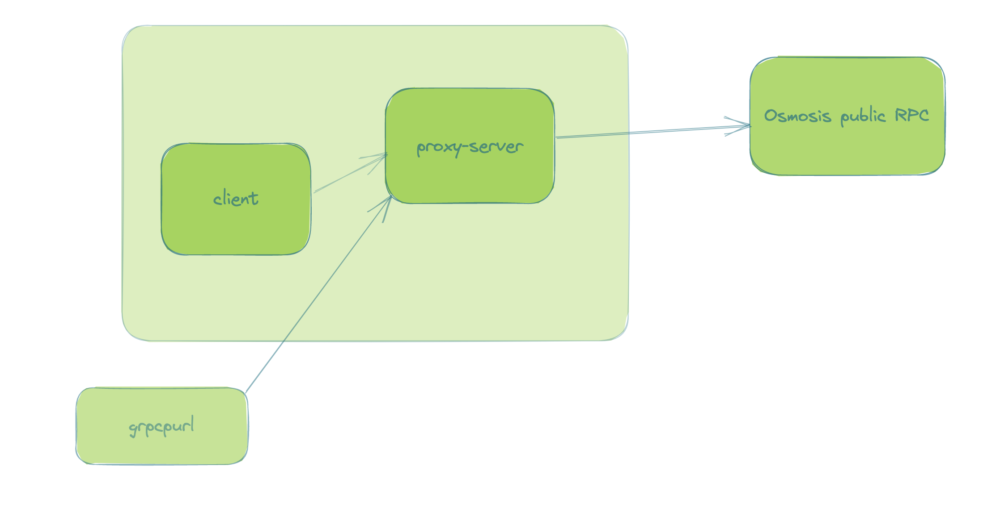

# state-tracker 
>* This repo containing code for a gRPC server and client that communicate via gRPC protocol.
>* Server implementation acts as a proxy server to a destination server.
>* Client is implemented as a state tracker machine which will query the proxy server for the latest block information
   via cosmos.base.tendermint.v1beta1.Service.GetLatestBlock API.
>* Latest block information are stored into json file with height and hash for the every 5 block.
>* Read blueprint for more info

### Blue print 
- Design blueprint is attached [here](https://hackmd.io/@FdW5ADdtSn6Xozlgy3Rsyg/rJ6_cQ472)

### Architecture diagram


# Pre requisites
- Go 1.19
- Ubuntu 20.04 (any linux based distros) / OSX

# Build & Run
* Application can be build and started by using Makefile.
* Make sure to cd to project folder.
* Run the below commands in the terminal shell.
* Make sure to run Pre-run and Go path is set properly

# Pre-run
    make mod
    make lint

# How to run unit test
    make test

# How to run build
    make build

# How to run
### There are 3 ways server and client can be run.

## I.Start via main file
> **Note**
> If .env.example is not available or set then default values will be used
* configure `.env.example`
``` text 
    PROXY_TO - destination server address where traffic needs to be proxied/ used by server 
    LISTEN_PORT - proxy server listening port 
    SERVER_ADDRESS - server address used by client 
```
* source your env file
### step:1 start server 
`go run cmd/server/main.go`

### step:2 start client
`go run cmd/clien/main.go`

## II.Start via locally build binary
Run these commands in terminal shell

* `cd state-tracker`
* `make build`
* `./state-tracker-server`
* `./state-tracker-client`
* `make clean` to cleanup locally build binary as well as block_data_{current-unix-timestamp}.json file
 
## III.Run as docker container
* Make sure to update the .env.example file before running as docker container
### step:1
    make docker-image-server
    make docker-run-server
### step:2
    make docker-image-client
    make docker-run-client

> **Note:**
>* Proxy server can work with any destination server. Replace the default osmosis to any grpc endpoint
>* Block info json files are stored in the root folder as block_data_{current-unix-timestamp}.json file.
